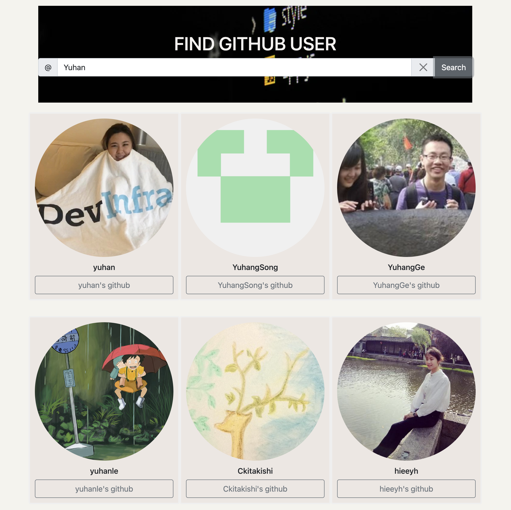

# Github User Finder project 
>This project is for Chingu solo project requirement.

---
## Overview

This app was created for the Chingu project pre-work. I used data from [GitHub API](<https://api.github.com/search/users?q=example>)

**LIVE LINK:** [Find GitHub User](<https://github-fetch-by-username.netlify.app/>)

---

## Features
- By enter the GitHub username, you can find the users that you are looking for.

- Users will be redirected to the Github profile when they click on the button underneath

---
 
## Tech Used/Dependencies
- This is a React App using Bootstrap

- Add-on package [axios](<https://github.com/axios/axios>)

- Image from [Unsplash](<https://unsplash.com/>)

